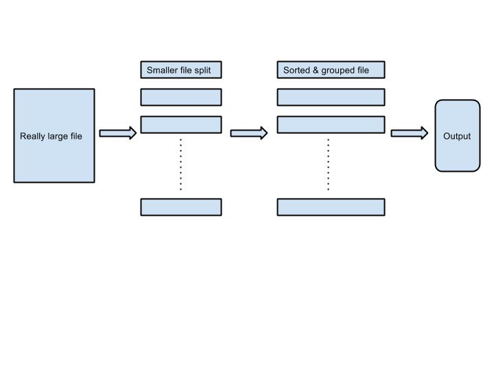

# IDE-CodeChallenge
Invited to take the coding challenge from the Insight Data Engineering program. This repo contains everything for that challenge.

More details about this code challenge: https://github.com/InsightDataScience/cc-example

More details about this program: http://insightdataengineering.com/

##More about the tweet word count feature

Intuitively, if the data is small, a sorted map data structure like tree map can be used to store and sort the word-count pair. But when processing very large dataset, the memory limit will be an issue when the data is too large to be fit in memory at once and thus that naive approach is not good. In contrast, the idea of Map-Reduce and Hadoop is employed here, i.e.: 
1. Split the input data into several temporary files; each contains the words with the same hashing value (after offset) 
2. Now each split file is much smaller than the input, for each of them, a tree map can be used to sort and group the word-count pair, and also put the word-count result in the map into another temporary file 
3. Now for each of those files generated in step 2, merge them into a single file, and reserve the order of word by using a priority queue data structure. Finally, clear up all the temporary files generated in step 1 and step 2

Step 1 and 2 together is like the Map phase in MapReduce, as the input file is split into several "chunks", while the output are intermediate files that the inside content are sorted and grouped. , while step 3 is like the Reduce phase, although the distributed systems mode is not supported in my program. Besides, step 2 can be facilitated by using multithread programming, but as this will lead to more complicated codes and far away from the code challenge scope, it is not supported here.

The tradeoff is that, generating temporary files and merging them will cost more time. For example, when data is small, the two approaches are same in running time, but for a input data that is not too large, say a ~4GB input file, the naive method that reads all data in memory at once took roughly 50 seconds, whereas in the same machine, the second approach took 70 seconds. For really large data, the performance difference has not been compared yet.

By default, the program process data in the naive mode. To run the program in the "MapReduce-like" mode, adding a "-d|D" flag to the command line, i.e.: <i>"java -cp src/TweetWordCount tweet_input/tweets tweet_output/ft1 <b>-d</b>"</i>
